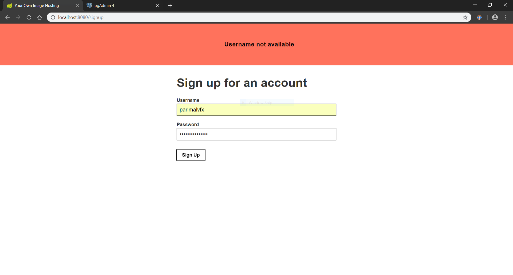

# ImageHoster

Image hosting website similar to Imgur

### Part A - Fixing Issues

#### User signup bugs

* Check added in `UserController` class for username validation at the time of registration. Also updated `signup.html` file with class for flashing error. If username is not available then error is added which will be flashed promptly on registration page:

    

#### Image upload issues

* Updated `ImageService`, `ImageServiceImpl`, `ImageManager` and `ImageController` classes to get images by id and to show images by title and id. Also updated `home.html` file with title + id link.

    

    Above three images with title _abc_ resolves to following URLs:

    ```
    http://localhost:8080/images/abc/3
    http://localhost:8080/images/abc/4
    http://localhost:8080/images/abc/5
    ```
